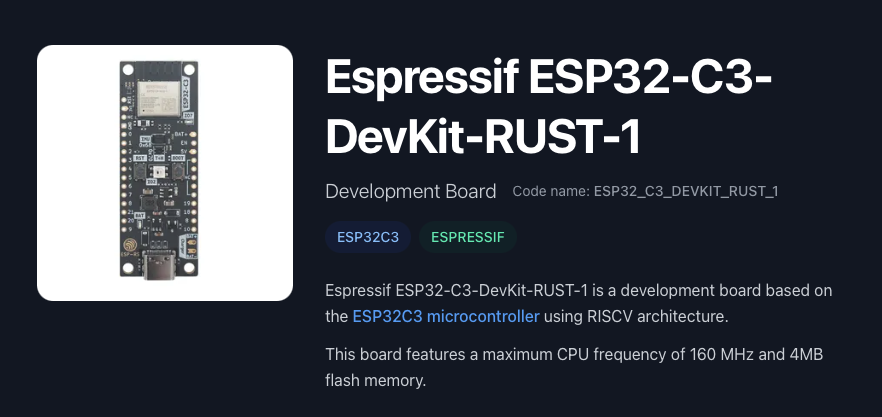
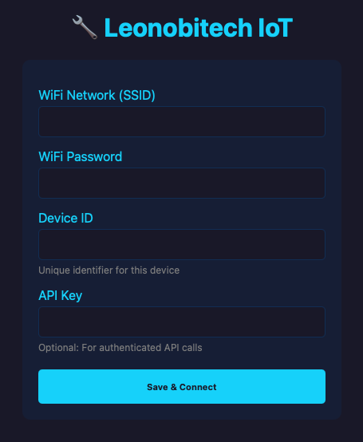

# Rust Embedded desde Cero

## paso-02-wifi-station

[](https://github.com/FMFigueroa/paso-02-wifi-station/actions/workflows/rust_ci.yml)

<p align="center">
  
</p>

Conexión WiFi Station con sistema de provisioning seguro. El ESP32 se conecta a una red WiFi usando credenciales almacenadas en NVS (flash). Si no está provisionado, crea un Access Point con portal web para configuración.

## Qué hace este paso

1. **First boot (sin credenciales):** crea AP "Leonobitech-Setup" → usuario abre `http://192.168.4.1` → ingresa SSID, password, device ID → credenciales se guardan en NVS → reinicia
2. **Boots siguientes (provisionado):** lee credenciales de NVS → conecta a WiFi → LED parpadea como heartbeat

## Pre-Requisitos

```bash
rustup --version          # Rust (nightly)
cmake --version           # Build system para ESP-IDF
ninja --version           # Backend de compilación
espflash --version        # Herramienta de flash
which ldproxy             # Linker proxy
```

Si falta algo:

```bash
# Rust
curl --proto '=https' --tlsv1.2 -sSf https://sh.rustup.rs | sh

# Dependencias (macOS)
brew install cmake ninja python3

# Target RISC-V
rustup target add riscv32imc-unknown-none-elf

# Herramientas de flash y linkeo
cargo install espflash cargo-espflash ldproxy
```

## Limpieza previa (recomendado)

Si tu ESP32 fue usado con otro firmware o tiene datos viejos en flash:

```bash
espflash erase-flash       # Borra toda la flash (4MB a ceros)
cargo clean                # Limpia cache del build y sdkconfig generado
```

> **Nota:** `cargo clean` es necesario si modificaste `sdkconfig.defaults`, ya que el archivo `sdkconfig` generado por ESP-IDF se cachea en `target/` y no se actualiza automáticamente.

## Compilar y flashear

```bash
cargo espflash flash --release --monitor
```

El primer build descarga y compila el ESP-IDF SDK (~2GB). Los siguientes son incrementales.

## Provisioning (primera vez)

1. Flashear el firmware
2. En el monitor serial verás: `Connect to WiFi: 'Leonobitech-Setup'`
3. Desde tu celular/PC, conectar a la red WiFi **Leonobitech-Setup** (password: `setup1234`)
4. Abrir `http://192.168.4.1` en el browser
5. Llenar el formulario: SSID de tu red, password, device ID y API key
6. El dispositivo guarda las credenciales y reinicia
7. Al reiniciar, conecta automáticamente a tu red WiFi

> **Device ID** y **API Key** se usan en pasos posteriores para conectar con el backend via WebSocket. Si querés probar el firmware completo en producción, registrate en [leonobitech.com](https://www.leonobitech.com) para obtener tus credenciales desde el dashboard.

<p align="center">
  
</p>

## Estructura

```
.cargo/config.toml        # Cross-compilation para riscv32imc-esp-espidf
Cargo.toml                # Dependencias: esp-idf-hal, esp-idf-svc, zeroize, etc.
rust-toolchain.toml        # Nightly + rust-src (build-std)
build.rs                   # Integración con ESP-IDF via embuild
sdkconfig.defaults         # WiFi, SoftAP, DHCP, NVS, mbedTLS, logging
src/
  main.rs                  # Punto de entrada: check provisioning → WiFi → heartbeat
  wifi.rs                  # Conexión WiFi Station (scan, connect, DHCP)
  secure_storage.rs        # NVS wrapper con Zeroize (credenciales seguras)
  provisioning.rs          # SoftAP + HTTP server + formulario web
```

## Dependencias

| Crate          | Uso                                                |
| -------------- | -------------------------------------------------- |
| `esp-idf-hal`  | Hardware Abstraction Layer (GPIO, modem, etc.)     |
| `esp-idf-svc`  | Servicios de alto nivel (WiFi, HTTP, NVS, logger)  |
| `embedded-svc` | Traits de servicios embedded (HTTP, ipv4)          |
| `heapless`     | Strings de tamaño fijo para config WiFi            |
| `zeroize`      | Borrado seguro de credenciales en memoria          |
| `log`          | Facade de logging (info!, error!, warn!)           |
| `anyhow`       | Manejo de errores con contexto                     |

## Documentacion

Te invito a unirte a nuestro servidor de Discord para que no te pierdas el desarrollo completo del curso **Rust - Embedded desde Cero**. Encontraras documentacion detallada de cada paso, explicaciones profundas de conceptos, cuestionarios y soporte directo.

<a href="https://discord.gg/dYrqe9HZfz">
  
</a>&ensp;
<a href="https://discord.gg/dYrqe9HZfz"><strong>Unirse al servidor — Curso Rust Embedded</strong></a>

## Roadmap

> Este repo es el **Paso 2** del curso **Rust Embedded desde Cero**.

- [Paso 1 — Scaffold del proyecto](https://github.com/FMFigueroa/paso-01-scaffold)
- **[Paso 2 — WiFi Station](https://github.com/FMFigueroa/paso-02-wifi-station)** ← _este repo_
- Paso 3 — LED PWM
- Paso 4 — WebSocket Client
- Paso 5 — Light State Management
- Paso 6 — Telemetria
- Paso 7 — Time Sync (SNTP)
- Paso 8 — Schedule & Auto Mode
- Paso 9 — Concurrencia & Watchdog

## Licencia

[MIT](LICENSE)
